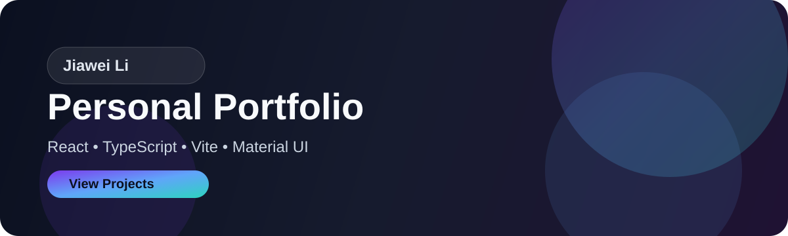

# Jiawei Li | Personal Portfolio

A personal portfolio and engineering profile built with React, TypeScript, Vite, and Material UI.

<p align="center">
  
</p>

## About

This repository is my personal portfolio homepage — a modern front-end project that blends a clean developer aesthetic with a polished product-brand feel.

The goal is simple: present my work, technical interests, project experience, and contact information in a way that feels both professional and approachable.

## What’s Inside

- responsive personal landing page
- premium visual design with strong layout hierarchy
- bilingual content support
- smooth scroll-triggered reveal animations
- structured sections for skills, projects, and profile
- clean data-driven content organization

## Tech Stack

- React 19
- TypeScript
- Vite
- Material UI
- Emotion

## Project Structure

```text
.
├── assets/
│   └── portfolio-banner.svg
├── index.html
├── package.json
├── README.md
├── LICENSE
├── src/
│   ├── App.tsx
│   ├── data.ts
│   ├── main.tsx
│   ├── styles.css
│   └── vite-env.d.ts
├── tsconfig.json
├── tsconfig.app.json
├── dist/            # generated by build
├── node_modules/    # installed dependencies
└── .gitignore
```

## Local Development

### Install dependencies

```bash
npm install
```

### Run locally

```bash
npm run dev
```

### Build for production

```bash
npm run build
```

### Preview production build

```bash
npm run preview
```

## Content Updates

Most content is centralized in `src/data.ts`, while the layout and presentation are handled in `src/App.tsx`.

Typical updates include:

- profile introduction
- work and project highlights
- technical skills and toolsets
- social links and contact methods

## License

This project is licensed under the MIT License. See [LICENSE](LICENSE) for details.

## Notes

This repository is meant to be a clean, reusable personal portfolio example for showcasing engineering capability, design taste, and project thinking.
